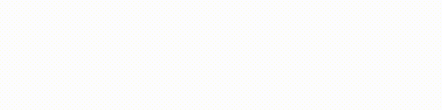
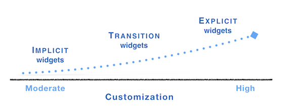
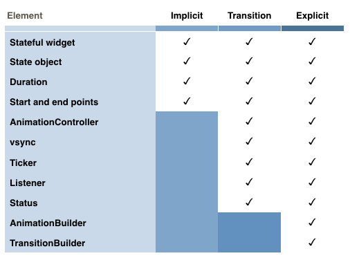

* TOC Placeholder
{:toc}



<script>
function loadImage()
</script>

Using Flutter animation widgets means you don’t have to write sophisticated drawing code to include animations in your app. The animation widgets already include definitions for  transitions from one widget to another using a visual effect like opacity or motion—so most of the code required to draw each animation frame is already written for you.  

## Animation widget types
Flutter animation widgets can be *implicit*, *transition*, or *explicit*.
Implicit animation widgets are the simplest to use since changes to the widgets automatically trigger an animation. Transition animations are similar but require you to explicitly trigger the animation.
If you’re starting out in animations, or you want to quickly add an animation to your app, try out the implicit or transition animation widgets.


<br>

For more customizable animations, Flutter provides explicit animation widgets. You can build your own explicit animations using `AnimatedBuilder`.


### Implicit animation widgets

 *Implicit animations* are animations that are already programmed or styled. You don’t need to write the animation code to add listeners or tickers for example, and you don't need to tell the app when to start—the animation begins automatically when a property value changes.

 <!-- The `AnimatedOpacity` and `AnimatedCrossFade` widgets are two examples of implicit animations. -->

 <table cellpadding="5" style="width:650px">
   <tr>
   <td style="width:5%">
   <a href="" onMouseOver="document.MyImage.src='/animations/images/animated_crossfade1.gif';" onMouseOut="document.MyImage.src='/animations/images/animated_crossfade1.png';">
   
   </a></td>
     <td style="width:15%">
    The <code>AnimatedCrossFade</code> and <code>AnimatedOpacity</code> widgets are two implicit animation widgets.
     </td>
     <td style="width:5%">
     <a href="" onMouseOver="document.MyImage1.src='/animations/images/animated_opacity.gif';" onMouseOut="document.MyImage1.src='/animations/images/animated_opacity.png';">
     
     </a></td>
   </tr>
 </table>


 <br>
 For more information, including the code for the implicit animation examples (above), and a list of implicit widgets, see [Flutter Implicit Animations](/animations/implicit_widgets).


### Transition animation widgets

*Transition animations* are easy to use like implicit animations because transition animation widgets are pre-defined for you, but they also allow you to customize some elements that are included in the explicit animations. Transition animations must be started by the app via a controlling or "parent" animation. With transition animation widgets, you can specify a visual effect that determines how the animation target object is animated. You include the `AnimationController` to control the animation. For example, you can control how the object is made visible or hidden or how to get from the start value to the end value.  

 <table cellpadding="5" style="width:650px">
  <tr>
   <td style="width:5%">
  <a href="" onMouseOver="document.MyImage3.src='/animations/images/rotation_transition.gif';" onMouseOut="document.MyImage3.src='/animations/images/rotation_transition.png';">
  
  </a></td>
    <td style="width:15%">
   The <code>RotationTransition</code> and <code>SlideTransition</code> widgets are two animation examples that use transition animation widgets.
    </td>
    <td style="width:5%">
    <a href="" onMouseOver="document.MyImage4.src='/animations/images/slide_transition.gif';" onMouseOut="document.MyImage4.src='/animations/images/slide_transition.png';">
    
    </a></td>
  </tr>
</table>


<br>
For more information including a list of transition widgets, [Flutter Transition Animations](/animations/transition_widgets).  


### Explicit animation widgets

 *Explicit animations* involve building customized animations using the `AnimatedBuilder` widget that allows you to customize many of the animation elements that are pre-defined in the implicit and transition animation widgets. When you build explicit animations, you manually add listeners, tickers, and other elements for customization.  
 <br>
 For more information, see [Flutter Explicit Animations](/animations/explicit_widgets).  

## Choosing an animation widget
Choosing an animation widget depends on the customization that you need for your animation and whether there is an existing widget available for reuse.

* Choose an implicit animation when you want to reuse an existing implicit animation widget and change the animation object. Using an implicit animation widget allows you to set the duration and a `curve` that determines how fast the animation progresses over its duration, and start and end points.

* Choose a transition animation when you want to reuse a transition animation widget, but you also want to customize some of the animation elements that are part of the `AnimationController` such as the ticker, listener, status, and the direction of the animation or the type of curve.

* Choose an explicit animation if you want to build an animation from scratch. You can also use an explicit animation to build implicit and transition animation widgets for reuse.


The table below shows the customizable elements in each animation type.


<br>


## Flutter packages
The Flutter SDK includes several libraries that contain pre-defined animation widgets. To access the Flutter animation widgets, determine the library that contains the widget that you want to use and then add the appropriate import statement to the `main.dart` file. For example, you may need to access Material widgets so you would add the following import statement.

```Dart
import 'package:flutter/material.dart';
```
<!-- For information on the SDK libraries and available widgets in each library, see the following resources.

* [Flutter SDK libraries](https://docs.flutter.io/index.html)  
* [Animation and Motion Widgets](/widgets/animation/)  
* [Flutter Widget Index](/widgets/widgetindex/)  
* [Widget Catalog](/widgets/) -->

## Flutter animation resources  
To learn about Flutter animations, check out the following resources.

### Concepts  
[Flutter Animation Concepts](/animations/concepts) describes how Flutter animation works and it includes definitions of the main animation concepts. You'll find information on the main animation widgets such as the `AnimationController` or `AnimationBuilder`, and information about [tweens](/animations/concepts#tweens), curves, tickers, and more.  


### Animation and Motion widgets  
For a list of Flutter animation widgets, see the following:
* [Implicit animation widgets](/animations/implicit_widgets)  
* [Transition animation widgets](/animations/transition_widgets)  
* [Explicit animation widgets](/animations/explicit_widgets)  
* [Animation and Motion Widgets Catalog](/widgets/animation/)  

### Animation FAQs
Check out the [Flutter Animation FAQs](/animations/animations_faqs) for specific questions and answers relating to Flutter animations.  And let us know what questions you would like to see added to the page!

### Animation patterns  
The following list provides links to "How-to" information or source code for some of the common and most popular animation widgets.  
* [AnimatedList](/catalog/samples/animated-list/)—How to display a list of cards that stay in sync using the  ListModel widget. When an item is added or removed from the model, the corresponding card animates in or out of view.
* [Shared element animations](/animations/hero-animations/)—How to build shared element animations. In Flutter, the [Hero animations widget](https://docs.flutter.io/flutter/widgets/Hero-class.html) is an example of a shared element animation. The guide shows two examples: a standard hero animation and one that transforms the image from a circular shape to a square shape during flight.  The [Shrine Demo](https://github.com/flutter/flutter/blob/master/examples/flutter_gallery/lib/demo/shrine_demo.dart) shows another example showing hero animations.
* [Staggered Animations Demo](/animations/staggered-animations/)—How to build a staggered animation where animations start at different points on a timeline.  
* [Flutter Gallery](https://github.com/flutter/flutter/tree/master/examples/flutter_gallery)—How to build the Flutter Gallery app and install it onto your device. The Flutter Gallery is a one-stop demo app that shows off many of the Material Design widgets and many types of animations.  
*  Physics-based animations—In physics-based animation, motion is modeled to resemble real-world behavior. When you toss a ball, for example, where and when it lands depends on the speed, the weight, and distance from the ground that the ball was tossed. Similarly, dropping a ball attached to a spring falls and bounces differently than dropping a ball attached to a string.  <br>
    Under the Material Components of the Flutter Gallery, the [Grid](https://github.com/flutter/flutter/blob/master/examples/flutter_gallery/lib/demo/material/grid_list_demo.dart) example demonstrates a fling physics-based animation. Select one of the images from the grid and zoom in. You can pan the image with flinging or dragging gestures.  
    <br>  
    The Flutter API documentation includes information on physics-based animation such as  [AnimationController.animateWith](https://docs.flutter.io/flutter/animation/AnimationController/animateWith.html) method and the [SpringSimulation](https://docs.flutter.io/flutter/physics/SpringSimulation-class.html) class.

### Flutter animation YouTube videos  
Another great way to learn about Flutter animations is to check out [Flutter animations on YouTube](https://www.youtube.com/results?search_query=Flutter+animations). For example, the [The Basics of Animation with Dart's Flutter Framework](https://www.youtube.com/watch?v=5urRyqOwTuo) tutorial describes the basics of tween-based animations in Flutter.

### Articles  
Check out the [Flutter Publication on Medium](https://medium.com/google-developer-experts/introducing-the-flutterdoc-publication-3becc900b611.com) for articles about developing apps using Flutter. Many third parties have published on Medium including the following articles:  
* [Zero to One with Flutter](https://medium.com/flutter-io/zero-to-one-with-flutter-43b13fd7b354) — *Discovering the strength of Flutter’s widget and tween concepts by writing chart animations in Dart for an Android/iOS app*.  
* [Zero to One with Flutter, Part Two](https://medium.com/flutter-io/zero-to-one-with-flutter-part-two-5aa2f06655cb) — *Discovering how to animate composite graphical objects in the context of a cross-platform mobile app*.
