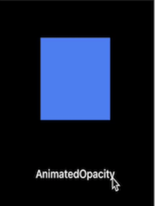

* TOC Placeholder
{:toc}

Transition animations are pre-defined and reusable—similar to implicit animations, but you control how the animation affects the animated object—similar to explicit animations.  

For example, you can reuse a `SlideTransition` animation widget and customize the way the animation target object becomes visible. You can push it into view from the left-side or the right-side of the display, or you can specify the type of curved animation applied to the object such as `elasticIn`, `elasticOut`, or `bounceIn`.

<!-- Transition animations implement the abstract class `AnimatedWidget`. The `AnimatedWidget` class allows you to separate the widget code from the animation code in the `setState()` call. The `AnimatedWidget` class doesn’t need to maintain a `State` object to hold the animation. Use the  `AnimatedWidget` helper class (instead of `addListener()` and `setState()`) to create a reusable transition animation widget.   -->


## Using a transition animation widget

<div>
<table class="table" width="100%">
  <col width="45%">
  <col width="55%">
	<tbody>
    <tr>
      <td></td>
      <td>
      1. Create your <code>StatefulWidget</code>.<br>
      2. Create the <code>State</code> class to hold the animation object, the <code>AnimationController</code>, and the transition animation widget.<br>
      3. Add the <code>vsync</code>, <code>listener</code>, and <code>[tween](/animations/concepts#tweens)</code>.<br>
      4. Specify the type of animation that you want to apply to the animation object.<br>
      5. Dispose of the controller. <br>
      6. Specify the <code>BuildContext</code> to return the _transition_ animation widget.<br>
      </td>
    </tr>
   </tbody>
  </table>
</div>

### Building your own transition animations
Flutter includes many transition animations that you can reuse but you can build your own. To create a reusable transition animation, create a widget that extends `AnimatedWidget`.

Pre-defined transition animations already extend the `AnimatedWidget` class that allows you to separate the widget code from the animation code in the `setState()` call. The `AnimatedWidget` class doesn’t need to maintain a `State` object to hold the animation.

## Transition animation examples  
The `RotationTransition` and `SlideTransition` are two examples that use transition animation widgets included in the widget package.  

### RotationTransition example
<!-- The `AnimatedOpacity` implicit widget automatically transitions a child's opacity over a given duration whenever the specified opacity changes. -->
<table cellpadding="10">
  <tr>
    <td style="width:25%">
    <a href="" onMouseOver="document.MyImage.src='/animations/images/rotation_transition.gif';" onMouseOut="document.MyImage.src='/animations/images/rotation_transition.png';">
    
    </a></td>
    <td>
    The <code>RotationTransition</code> widget automatically rotates a widget.
    </td>
  </tr>
</table>

<!-- <a href="" onMouseOver="document.MyImage1.src='images/AnimatedOpacity_blue.gif';" onMouseOut="document.MyImage1.src='images/AnimatedOpacity_blue.png';">

</a>
Mouseover the image to view the animation using the <code>AnimatedOpacity</code> implicit widget. -->

<!-- <div>


 <script>
 imgOn2 = new Image;
 imgOff2 = new Image;
 imgOn2.src = "images/AnimatedOpacity_blue.gif";
 imgOff2.src = "images/AnimatedOpacity_blue.png";
 </script>

 <a href="#C4" onClick="document.img.src=imgOn2.src;">▶︎</a>
 <a href="#C4" onClick="document.img.src=imgOff2.src;">◼︎</a>

 This example shows an animation using the <code>AnimatedOpacity</code> implicit widget.
</div> -->

 <!-- <br>
 The `AnimatedOpacity` implicit widget automatically transitions a child's opacity over a given duration whenever the given opacity changes. Notice that the listeners, tickers, and other animation elements are *implied* so you don't need to add them. The `AnimatedOpacity` class extends `ImplicitlyAnimatedWidget` and those elements are already included in the `ImplicitlyAnimatedWidget` class. -->

The code for the `RotationTransition` example is shown below.   
<!-- skip -->

```Dart
import 'package:flutter/material.dart';

void main() {
  runApp(
    new MaterialApp(
      home: new HomePage(),
    ),
  );
}

class HomePage extends [[highlight]]StatefulWidget[[/highlight]] {
  @override
  HomePageState createState() => new HomePageState();
}

class HomePageState extends [[highlight]]State<HomePage> [[/highlight]]{
  bool selected = false;

  @override
  Widget [[highlight]]build(BuildContext context) [[/highlight]]{
    return new RotationTransitionExample(
      selected: selected,
      onTap: (bool value) {
        setState(() {
          selected = value;
        });
      },
    );
  }
}

class [[highlight]]RotationTransitionExample extends StatefulWidget[[/highlight]] {
  const RotationTransitionExample({
    Key key,
    this.selected = false,
    this.onTap,
  }) : super(key: key);

  final ValueChanged<bool> onTap;
  final bool selected;

  @override
  RotationTransitionExampleState createState() => new RotationTransitionExampleState();
}

class RotationTransitionExampleState extends State<RotationTransitionExample>
// The TickerProviderStateMixin makes it so that this state object can
// be used as the vsync for the AnimationController.
  [[highlight]]  with TickerProviderStateMixin<RotationTransitionExample>[[/highlight]] {
  AnimationController _controller;
  Animation<double> _rotationAnimation;

  @override
  void initState() {
    super.initState();
    // Create an animation controller, and rebuild the widget tree when we
    // listen to it, in order to generate frames.
  [[highlight]]  _controller = new AnimationController(
      duration: const Duration(seconds: 2),
      vsync: this,
    )..addListener(()[[/highlight]] {
      setState(() {
        // The value of the animation controller has changed, so we need to
        // rebuild the widget tree.
      });
    });

    // Set up the animation curve that we want to use.
    _rotationAnimation = new [[highlight]]CurvedAnimation[[/highlight]](
      parent: _controller,
      // There are many different types of curves.
      curve: Curves.elasticOut,
    );
  }

  @override
  void didUpdateWidget(RotationTransitionExample oldWidget) {
    super.didUpdateWidget(oldWidget);
    if (oldWidget.selected == widget.selected) {
      return;
    }
    // Change the direction of the animation based on whether selected is true
    // or not.  Note that this means if you tap it twice quickly, the animation
    // will only just get started, and reverse to the original position.
    widget.selected ? _controller.forward() : _controller.reverse();
  }

  @override
  void dispose() {
    // The controller must be disposed of, so it is usually owned by a
    // StatefulWidget.
    _controller?.dispose();
    super.dispose();
  }

  @override
  Widget build(BuildContext context) {
    return GestureDetector(
      onTap: () {
        setState(() {
          widget.onTap(!widget.selected);
        });
      },
      child: Container(
        color: Colors.white,
        [[highlight]]child: new RotationTransition[[/highlight]](
          turns: _rotationAnimation,
          child: const FlutterLogo(),
        ),
      ),
    );
  }
}

```


#### RotationTransition widget code

The code for the `RotationTransition` animation widget used in the example is shown below. Notice that this widget extends `AnimatedWidget`. When you want to create a new transition widget that you can reuse, extend `AnimatedWidget`.


```Dart
[[highlight]]class RotationTransition extends AnimatedWidget [[/highlight]]{
  /// Creates a rotation transition.
  ///
  /// The [turns] argument must not be null.
  const RotationTransition({
    Key key,
    @required Animation<double> turns,
    this.child,
  }) : super(key: key, listenable: turns);

  /// The animation that controls the rotation of the child.
  ///
  /// If the current value of the turns animation is v, the child will be
  /// rotated v * 2 * pi radians before being painted.
  Animation<double> get turns => listenable;

  /// The widget below this widget in the tree.
  ///
  /// {@macro flutter.widgets.child}
  final Widget child;

  @override
  Widget build(BuildContext context) {
    final double turnsValue = turns.value;
    final Matrix4 transform = new Matrix4.rotationZ(turnsValue * math.pi * 2.0);
    return new Transform(
      transform: transform,
      alignment: Alignment.center,
      child: child,
    );
  }
}
```



### SlideTransition example
<!-- The `AnimatedOpacity` implicit widget automatically transitions a child's opacity over a given duration whenever the specified opacity changes. -->
<table cellpadding="10">
  <tr>
    <td style="width:25%">
    <a href="" onMouseOver="document.MyImage2.src='/animations/images/slide_transition.gif';" onMouseOut="document.MyImage2.src='/animations/images/slide_transition.png';">
    
    </a></td>
    <td>
    The <code>SlideTransition</code> transition widget automatically animates the position of a widget relative to its normal position.
    </td>
  </tr>
</table>

<!-- <a href="" onMouseOver="document.MyImage1.src='images/AnimatedOpacity_blue.gif';" onMouseOut="document.MyImage1.src='images/AnimatedOpacity_blue.png';">

</a>
Mouseover the image to view the animation using the <code>AnimatedOpacity</code> implicit widget. -->

<!-- <div>


 <script>
 imgOn2 = new Image;
 imgOff2 = new Image;
 imgOn2.src = "images/AnimatedOpacity_blue.gif";
 imgOff2.src = "images/AnimatedOpacity_blue.png";
 </script>

 <a href="#C4" onClick="document.img.src=imgOn2.src;">▶︎</a>
 <a href="#C4" onClick="document.img.src=imgOff2.src;">◼︎</a>

 This example shows an animation using the <code>AnimatedOpacity</code> implicit widget.
</div> -->

 <!-- <br>
 The `AnimatedOpacity` implicit widget automatically transitions a child's opacity over a given duration whenever the given opacity changes. Notice that the listeners, tickers, and other animation elements are *implied* so you don't need to add them. The `AnimatedOpacity` class extends `ImplicitlyAnimatedWidget` and those elements are already included in the `ImplicitlyAnimatedWidget` class. -->

The code for the `SlideTransition` example is shown below.  
<!-- skip -->

```Dart
import 'package:flutter/material.dart';

void main() {
  runApp(
    new MaterialApp(
      home: new HomePage(),
    ),
  );
}

class HomePage extends [[highlight]]StatefulWidget[[/highlight]] {
  @override
  HomePageState createState() => new HomePageState();
}

class HomePageState extends [[highlight]]State<HomePage> [[/highlight]]{
  bool selected = false;

  @override
  Widget build(BuildContext context) {
    return new SlideTransitionExample(
      selected: selected,
      onTap: (bool value) {
        setState(() {
          selected = value;
        });
      },
    );
  }
}

class SlideTransitionExample extends StatefulWidget {
  const SlideTransitionExample({
    Key key,
    this.selected = false,
    this.onTap,
  }) : super(key: key);

  final ValueChanged<bool> onTap;
  final bool selected;

  @override
  SlideTransitionExampleState createState() => new SlideTransitionExampleState();
}

class SlideTransitionExampleState extends State<SlideTransitionExample>
// The TickerProviderStateMixin makes it so that this state object can
// be used as the vsync for the AnimationController.
    [[highlight]]with TickerProviderStateMixin<SlideTransitionExample>[[/highlight]] {

  // Because this animation doesn't just drive something that's a double,
  // we need a Tween to do the mapping from a double to an Offset.
  [[highlight]]static final Tween<Offset> _offsetTween = new Tween<Offset>[[/highlight]](
    // Start with no offset.
    begin: Offset.zero,
    // End at this offset, which is down and to the right. The numbers are in
    // multiples of the size of the child widget, so it'll travel half of a
    // full width to the right, and a full height of the child down.
    end: const Offset(0.5, 1.0),
  );

  AnimationController _controller;
  Animation<Offset> _slideAnimation;

  @override
  void initState() {
    super.initState();
    // Create an animation controller, and rebuild the widget tree when we
    // listen to it, in order to generate frames.
    [[highlight]]_controller = new AnimationController(
      duration: const Duration(seconds: 1),
      vsync: this,
    )..addListener(() [[/highlight]]{
      setState(() {
        // The value of the animation controller has changed, so we need to
        // rebuild the widget tree.
      });
    });

    // Use a curved animation to drive the Tween<Offset> to give interpolated
    // values between the start and end of the Tween.
    _slideAnimation = _offsetTween.animate(
      new CurvedAnimation(
        parent: _controller,
        curve: Curves.fastOutSlowIn,
      ),
    );
  }

  @override
  void didUpdateWidget(SlideTransitionExample oldWidget) {
    super.didUpdateWidget(oldWidget);
    if (oldWidget.selected == widget.selected) {
      return;
    }
    // Change the direction of the animation based on whether selected is true
    // or not.  Note that this means if you tap it twice quickly, the animation
    // will only just get started, and reverse to the original position.
    widget.selected ? _controller.forward() : _controller.reverse();
  }

  @override
  void dispose() {
    // The controller must be disposed of, so it is usually owned by a
    // StatefulWidget.
    _controller?.dispose();
    super.dispose();
  }

  @override
  Widget build(BuildContext context) {
    return GestureDetector(
      onTap: () {
        setState(() {
          widget.onTap(!widget.selected);
        });
      },
      child: Container(
        color: Colors.white,
        [[highlight]]child: new SlideTransition([[/highlight]]
          position: _slideAnimation,
          child: const Padding(
            padding: const EdgeInsets.all(8.0),
            child: const FlutterLogo(size: 150.0),
          ),
        ),
      ),
    );
  }
}

```


#### SlideTransition widget code

The code for the `SlideTransition` animation widget used in the example, is shown below. Notice that this transition widget extends `AnimatedWidget`. When you want to create a new transition widget that you can reuse, extend `AnimatedWidget`.


```Dart
/// Animates the position of a widget relative to its normal position.
///
/// The translation is expressed as a [Offset] scaled to the child's size. For
/// example, an [Offset] with a `dx` of 0.25 will result in a horizontal
/// translation of one quarter the width of the child.
///
/// By default, the offsets are applied in the coordinate system of the canvas
/// (so positive x offsets move the child towards the right). If a
/// [textDirection] is provided, then the offsets are applied in the reading
/// direction, so in right-to-left text, positive x offsets move towards the
/// left, and in left-to-right text, positive x offsets move towards the right.  
/// Creates a fractional translation transition.
///
/// The [position] argument must not be null.  

  [[highlight]]class SlideTransition extends AnimatedWidget[[/highlight]] {  
  const SlideTransition({
    Key key,
    @required Animation<Offset> position,
    this.transformHitTests = true,
    this.textDirection,
    this.child,
  }) : assert(position != null),
       super(key: key, listenable: position);

  /// The animation that controls the position of the child.
  ///
  /// If the current value of the position animation is `(dx, dy)`, the child
  /// will be translated horizontally by `width * dx` and vertically by
  /// `height * dy`, after applying the [textDirection] if available.
  Animation<Offset> get position => listenable;

  /// The direction to use for the x offset described by the [position].
  ///
  /// If [textDirection] is null, the x offset is applied in the coordinate
  /// system of the canvas (so positive x offsets move the child towards the
  /// right).
  ///
  /// If [textDirection] is [TextDirection.rtl], the x offset is applied in the
  /// reading direction such that x offsets move the child towards the left.
  ///
  /// If [textDirection] is [TextDirection.ltr], the x offset is applied in the
  /// reading direction such that x offsets move the child towards the right.
  final TextDirection textDirection;

  /// Whether hit testing should be affected by the slide animation.
  ///
  /// If false, hit testing will proceed as if the child was not translated at
  /// all. Setting this value to false is useful for fast animations where you
  /// expect the user to commonly interact with the child widget in its final
  /// location and you want the user to benefit from "muscle memory".
  final bool transformHitTests;

  /// The widget below this widget in the tree.
  ///
  /// {@macro flutter.widgets.child}
  final Widget child;

  @override
  Widget build(BuildContext context) {
    Offset offset = position.value;
    if (textDirection == TextDirection.rtl)
      offset = new Offset(-offset.dx, offset.dy);
    return new FractionalTranslation(
      translation: offset,
      transformHitTests: transformHitTests,
      child: child,
    );
  }
}

```


## Transition animations widgets

The Flutter SDK <a href="https://docs.flutter.io/flutter/widgets/widgets-library.html">widgets</a> library includes the following transition animation widgets.

<div>
<table class="table" width="100%">
  <col width="25%">
  <col width="70%">
	<thead>
		<tr>
			<th>Transition widget</th>
			<th>Description</th>
		</tr>
	</thead>
	<tbody>
    <tr>
			<td><a href="https://docs.flutter.io/flutter/widgets/DecoratedBoxTransition-class.html">DecoratedBoxTransition</a> </td>
			<td>This widget is the animated version of a <a href="https://docs.flutter.io/flutter/widgets/DecoratedBox-class.html">DecoratedBox</a> that animates the different properties of its <a href="https://docs.flutter.io/flutter/painting/Decoration-class.html">Decoration</a>.<br>

      </td>
		</tr>
    <tr>
			<td><a href="https://docs.flutter.io/flutter/widgets/FadeTransition-class.html">FadeTransition</a> </td>
			<td>This widget animates the opacity of a widget.
      </td>
		</tr>
    <tr>
			<td><a href="https://docs.flutter.io/flutter/widgets/PositionedTransition-class.html">PositionedTransition</a> </td>
			<td>This widget is the animated version of <a href="https://docs.flutter.io/flutter/widgets/Positioned-class.html">Positioned</a> which takes a specific <a href="url">Animation</a> to transition the child's position from a start position to and end position over the lifetime of the animation. This requires that the child is part of a <a href="https://docs.flutter.io/flutter/widgets/Stack-class.html">Stack</a>.
      </td>
		</tr>
    <tr>
			<td><a href="https://docs.flutter.io/flutter/widgets/RelativePositionedTransition-class.html">RelativePositionedTransition</a> </td>
			<td>This widget is the animated version of <a href="https://docs.flutter.io/flutter/widgets/Positioned-class.html">Positioned</a> which transitions the child's position based on the value of the <a href="url">rect</a> property relative to a bounding box with the specified size. This requires that the child is part of a <a href="https://docs.flutter.io/flutter/widgets/Stack-class.html">Stack</a>.
      </td>
		</tr>
    <tr>
			<td><a href="https://docs.flutter.io/flutter/widgets/RotationTransition-class.html">RotationTransition</a> </td>
			<td>This widget animates the rotation of a widget.
      </td>
		</tr>
    <tr>
			<td><a href="https://docs.flutter.io/flutter/widgets/ScaleTransition-class.html">ScaleTransition</a> </td>
			<td>This widget animates the scale of a widget.
      </td>
		</tr>
    <tr>
			<td><a href="https://docs.flutter.io/flutter/widgets/SizeTransition-class.html">SizeTransition</a> </td>
			<td>This widget animates its own size and clips and aligns the child.
      </td>
		</tr>
    <tr>
			<td><a href="https://docs.flutter.io/flutter/widgets/SlideTransition-class.html">SlideTransition</a> </td>
			<td>This widget animates the position of a widget relative to its normal position.
      </td>
		</tr>

	</tbody>
</table>
